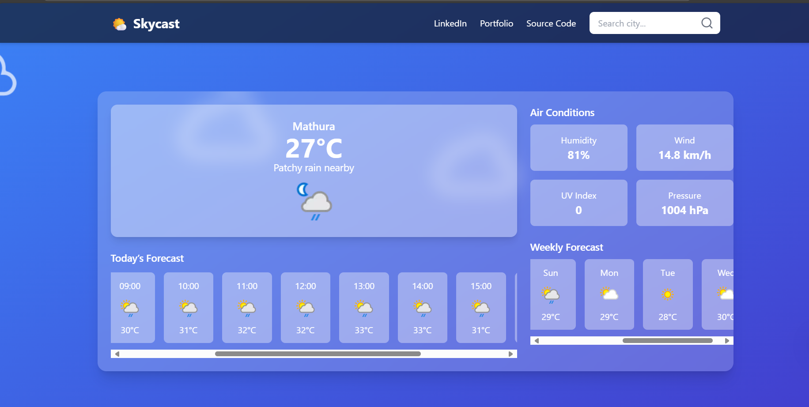

# 🌦️ Weather App

A modern weather application built with **HTML, CSS, and JavaScript** using the [WeatherAPI](https://www.weatherapi.com/).  
It displays **current weather, hourly forecast (6 AM – 6 PM), and 7-day forecast** for any city.

---

## 🚀 Features
- 🌍 Search weather by city name  
- 🌡️ Current weather with temperature, condition, and icon  
- 📊 Extra details: humidity, wind speed, UV index, and pressure  
- 🕑 Hourly forecast (6 AM – 6 PM) for today  
- 📅 Weekly forecast for 7 days  
- 🎨 Responsive design with clean UI  

---

### For live demo: skyy-cast.netlify.app

## 📸 Full Preview

